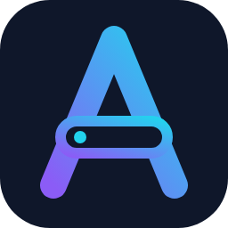

<p align="center">
  
</p>

<h1 align="center">Amaze Browser</h1>

<p align="center">
  <b>A real Chromium browser inside VS Code.</b><br/>
  Preview your site, open DevTools and test devices without leaving the editor.
</p>

<p align="center">
  <a href="https://open-vsx.org/extension/abhijeetkaze/amaze-browser"></a>
  <a href="https://open-vsx.org/extension/abhijeetkaze/amaze-browser"></a>
  <a href="LICENSE"></a>
  <a href="https://www.buymeacoffee.com/abhijeetkaze"></a>
  <a href="https://abhijeetmohanta.in"></a>
</p>

<p align="center">
  
</p>

## Why Amaze Browser

- **It's a real browser.** Pages render in Chromium, not a static preview, so JavaScript, cookies and logins behave exactly as they do in Chrome.
- **Nothing extra to install on Linux.** The first time it runs, it downloads its own open-source Chromium. On macOS and Windows it uses the Chrome or Edge you already have.
- **Made for building websites.** DevTools, device emulation and auto-reload of local files all work inside the editor panel.

## Features

| Feature | What it does |
| --- | --- |
| **Embedded browser** | Browse any URL or local file in an editor tab, with back, forward, reload and an address bar |
| **Zoom** | Zoom the page from the toolbar or with <kbd>Ctrl</kbd>+<kbd>=</kbd>, <kbd>Ctrl</kbd>+<kbd>-</kbd> and <kbd>Ctrl</kbd>+<kbd>0</kbd> (<kbd>Cmd</kbd> on macOS), from 25% to 500% |
| **Find in page** | <kbd>Ctrl</kbd>+<kbd>F</kbd> (<kbd>Cmd</kbd>+<kbd>F</kbd> on macOS) highlights every match, with a count and next/previous |
| **Tabs and history** | Open new tabs with one click and jump back to your 10 most recent pages |
| **Clear browsing data** | Delete history and cookies in one step |
| **Downloads and uploads** | Files download to `~/Downloads`; file pickers open VS Code's own dialog |
| **DevTools** | Full Chrome DevTools next to your page: Elements, Console, Network and more |
| **Inspect element** | Highlight any element on the page; in React dev builds, jump to the component's source file |
| **Device emulation** | Preview your site at phone and tablet sizes, with matching user agents |
| **Right-click menu** | Open or copy links and images, cut, copy, paste and select text, view page source |
| **Live reload** | Files opened with **Open Active File in Preview** reload when you save |
| **Debugging** | Attach VS Code's JavaScript debugger with a `launch.json` configuration |
| **Remembers sessions** | Cookies and local storage persist, so you stay logged in |
| **Theme aware** | Pages see your VS Code dark or light theme through `prefers-color-scheme` |
| **No telemetry** | Nothing is collected or sent anywhere |

## Install

**VSCodium, Cursor, Windsurf, Gitpod and other Open VSX editors:** search for **Amaze Browser** in the Extensions view, or run:

```sh
codium --install-extension abhijeetkaze.amaze-browser
```

**VS Code:** download the `.vsix` from the [Open VSX page](https://open-vsx.org/extension/abhijeetkaze/amaze-browser), then run **Extensions: Install from VSIX...** from the Command Palette.

## Getting started

1. Open the Command Palette (<kbd>Ctrl</kbd>+<kbd>Shift</kbd>+<kbd>P</kbd>, or <kbd>Cmd</kbd>+<kbd>Shift</kbd>+<kbd>P</kbd> on macOS).
2. Run **Amaze Browser: Open...** and enter a URL, for example `http://localhost:3000`.
3. Click the bug icon in the editor title bar to open DevTools.

To preview the HTML file you're editing, run **Amaze Browser: Open Active File in Preview**.

### DevTools position

DevTools opens next to the page by default. On a smaller screen, click the layout button in the DevTools tab's title bar (or run **Amaze Browser: Move DevTools...**) and choose:

- **Right**: next to the page
- **Bottom**: below the page, so both get the full width
- **Left**: before the page
- **Separate Window**: its own VS Code window, for a second monitor

Your choice is remembered (setting `amaze-browser.devToolsPosition`).

### Tabs and history

The toolbar has a **+** button for a new tab and a clock button that lists the 10 most recently visited pages across all tabs. History is kept between VS Code sessions.

**Clear History and Cookies...** (at the bottom of the history list, or from the Command Palette) deletes the history and every cookie, which signs you out of websites. It works whether or not a tab is open.

### Downloads and uploads

Files you download are saved to `~/Downloads` (change it with `amaze-browser.downloadPath`). A notification shows the progress, lets you cancel, and offers **Open** and **Show in Folder** when it's done. If a file with the same name exists, the new one is saved as `name (1).ext`.

When a page asks you to choose a file to upload, VS Code's file picker opens in your workspace folder. If the page only accepts certain types (for example images), the picker shows those first.

### Commands

| Command | What it does |
| --- | --- |
| `Amaze Browser: Open...` | Open a URL in a new browser tab |
| `Amaze Browser: New Tab` | Open a new tab at the start page |
| `Amaze Browser: Show History` | Pick one of your 10 most recent pages |
| `Amaze Browser: Move DevTools...` | Put DevTools on the right, bottom or left, or in a separate window |
| `Amaze Browser: Clear History and Cookies` | Delete history and all cookies (asks first) |
| `Amaze Browser: Show Support Notification` | Show the option to buy me a coffee |
| `Amaze Browser: Open Active File in Preview` | Open the current file, reloading on save |
| `Amaze Browser: Refresh Page` | Reload the current page |
| `Amaze Browser: Open page with system browser` | Open the current page in your default browser |
| `Amaze Browser: Open debug page` | Open DevTools for the current page |

### Debugging with VS Code

Add this to `.vscode/launch.json` to start a page and attach the debugger:

```jsonc
{
  "type": "amaze-browser",
  "request": "launch",
  "name": "Amaze Browser: Launch",
  "url": "http://localhost:3000"
}
```

Use `"request": "attach"` to attach to a page that's already open.

## Settings

| Setting | Default | Description |
| --- | --- | --- |
| `amaze-browser.startUrl` | this repo | Page opened when no URL is given |
| `amaze-browser.chromeExecutable` | | Path to a Chrome or Chromium executable. Leave empty to use the bundled or detected browser |
| `amaze-browser.storeUserData` | `true` | Keep cookies and local storage between sessions |
| `amaze-browser.localFileAutoReload` | `true` | Reload local files when they change |
| `amaze-browser.ignoreHttpsErrors` | `true` | Allow self-signed HTTPS certificates |
| `amaze-browser.devToolsPosition` | `right` | Where DevTools opens: `right`, `bottom`, `left` or `window` |
| `amaze-browser.downloadPath` | `~/Downloads` | Folder where downloads are saved |
| `amaze-browser.proxy` | | Proxy server, for example `http://127.0.0.1:8080` |
| `amaze-browser.otherArgs` | | Extra Chromium command-line arguments |
| `amaze-browser.format` | `jpeg` | Image format for rendering the page (`png` or `jpeg`) |
| `amaze-browser.quality` | `80` | Image quality for rendering (lower is faster) |
| `amaze-browser.everyNthFrame` | `1` | Render every Nth frame (higher is lighter on CPU) |
| `amaze-browser.debugHost` | `localhost` | Host for the debugging connection |
| `amaze-browser.debugPort` | `9222` | Port for the debugging connection. The next free port is used if it's taken |
| `amaze-browser.showSupportPrompt` | `true` | Occasionally ask whether you'd like to support the project (at most twice, only after regular use) |
| `amaze-browser.verbose` | `false` | Log protocol messages for troubleshooting |

## Which browser is used

Amaze Browser picks the browser in this order:

1. The executable set in `amaze-browser.chromeExecutable`
2. **Linux only:** a Chromium build that Amaze Browser downloads itself
3. A Chrome or Edge installation found on the system

### Bundled Chromium (Linux)

If `amaze-browser.chromeExecutable` is not set, Amaze Browser downloads an open-source [Chromium snapshot](https://commondatastorage.googleapis.com/chromium-browser-snapshots/index.html?prefix=Linux_x64/) (~150MB) the first time it activates and shows the progress in a notification. Later activations reuse it.

It is saved in the extension's global storage folder:

```
~/.config/Code/User/globalStorage/abhijeetkaze.amaze-browser/chromium/chromium/linux-<build>/chrome-linux/chrome
```

The first part of the path depends on how you run VS Code:

| Setup | Global storage folder |
| --- | --- |
| VS Code | `~/.config/Code/User/globalStorage/abhijeetkaze.amaze-browser/` |
| VS Code Insiders | `~/.config/Code - Insiders/User/globalStorage/abhijeetkaze.amaze-browser/` |
| VSCodium | `~/.config/VSCodium/User/globalStorage/abhijeetkaze.amaze-browser/` |
| Remote-SSH / WSL | `~/.vscode-server/data/User/globalStorage/abhijeetkaze.amaze-browser/` |

Things to know:

- The build is pinned by `CHROMIUM_BUILD_ID` in [`src/ChromiumDownloader.ts`](src/ChromiumDownloader.ts). When it changes, the new build is downloaded once and older builds are deleted.
- The download is kept across extension updates and removed by VS Code when the extension is uninstalled.
- Chromium needs the usual system libraries (for example `libnss3`, `libatk-bridge2.0-0`, `libgbm1`). If they are missing, install them or set `amaze-browser.chromeExecutable` to another browser.
- If the download fails, Amaze Browser shows a warning, falls back to a system browser and tries the download again on the next launch.

## Development

```sh
pnpm install
pnpm run build:dev   # build the webview and the extension
```

Then press <kbd>F5</kbd> in VS Code to launch an Extension Development Host with Amaze Browser loaded.

The extension icon is drawn in [`resources/icon.svg`](resources/icon.svg). After editing it, export it to a 256×256 `resources/icon.png`.

## Author

Amaze Browser is built and maintained by **Abhijeet Mohanta**. See my other projects and get in touch at **[abhijeetmohanta.in](https://abhijeetmohanta.in)**, or follow my work on [GitHub](https://github.com/abhijeetkaze).

## Support

Amaze Browser is free and open source. If it saves you time, you can buy me a coffee to support its development.

<a href="https://www.buymeacoffee.com/abhijeetkaze"></a>

## Credits

Amaze Browser is a fork of [Browse Lite](https://github.com/antfu/vscode-browse-lite) by [Anthony Fu](https://github.com/antfu), which was itself forked from [Browser Preview](https://github.com/auchenberg/vscode-browser-preview) by [Kenneth Auchenberg](https://github.com/auchenberg). Thanks to both for the original work.

## License

[MIT](LICENSE)

Copyright (c) 2019 Kenneth Auchenberg<br/>
Copyright (c) 2021 Anthony Fu<br/>
Copyright (c) 2026 Abhijeet Mohanta
